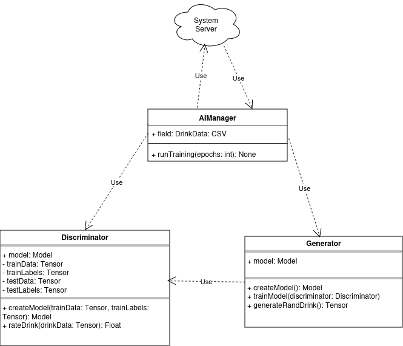

# **High-Level Design**

# **System Components**

## **Customer Client (App)**

The App is primarily responsible for providing a platform for users to create, order, and pay for drinks.  As well as notifying the store when they are ready to pick up their drinks. It should be accessible to most users and be fairly intuitive to use. The app will be designed to make ordering drinks the most clear functionality, and will highlight the AI’s capability of recommending drinks.  It is made up of the following subcomponents. 

### **Platform**

For this iteration of the app, the user client will be developed for Android. Talking with the customer, we determined that an app is essential, and Android is more accessible to develop for. In future iterations, we will port this to IOS and web browsers. 

### **Framework and Languages**

The Customer Client will be designed to run on Android. We also considered developing a web application, and IOS app, but decided to focus on creating a single, functional demo in this iteration. As the customer explained, having a mobile app was essential to the functionality of his project, so we had to choose between Android and IOS. Android was more accessible with our current development resources, so we chose to target this platform first. 

### **Subcomponents** 

#### **Drink Ordering (Overview)**

Drink creation will be the focus of the app, and therefore be the first thing that they access after signing in. The home screen of the app will feature an easily accessible menu with three different pages:

* “My Drinks”: containing the user’s previously ordered drinks.   
* “Menu”: containing a premade drink menu    
* “Custom Drinks”: containing an environment for the user to create custom drinks, or have AI generate a drink. 

More information can be found on each of these components under their respective sections.

#### **My Drinks**

The My Drink menu will display a visually appealing list of the past drinks the user ordered. The first priority in ordering will be the user rating of each drink, then the date that the drink was ordered, with newer ones being first. 

#### **Menu**

The menu will be composed of 6 pre-generated drinks that are generated at the start of each day by the AI assistant. The drinks that are most likely to be desirable to the customer are placed at the top of the menu, with the menu descending to those drinks which may not be the user’s initial choice, but nevertheless provides a variety of options for the user to choose from. 

#### **Custom Drink**

The custom drink option will allow the user to create their own bespoke drink, as opposed to relying on the generated drinks by the AI or the 6 pre generated drinks in the menu. The user will be able to choose any quantity of syrups, sodas (also known as “bases”), and toppings. These items will initially be categorized into broad categories, such as sweet, sour, and bitter. The user will also be able to filter between these options. A potential category that may be added is the user’s favorite options in their own category, allowing the user to quickly make the desired choice and then select more options further on.

#### **Cart**

The shopping cart will consist of the drinks the user has placed into the cart. From here, the user will be able to edit the drinks’ ingredients, the quantity, and delete the drinks they do not want to have. At the bottom of the cart page, there will be a button to navigate to the payment page. 

#### **Payment**

The payment will be taken in several different forms.  
As this application will be initially developed for Android and therefore the Play Store, the Play Store’s legal requirements must be taken into account. One such requirement is that Google Pay be a usable medium for performing a transaction, therefore we must implement Google Pay. On top of Google Pay, we aim to implement Stripe payment as an option, as well as giving the user the ability to simply enter their card information without using an external medium such as those two previously mentioned.

The user will be able to make a payment through these, as well as apply any coupons they may have.

#### **AI**

This section refers to the AI implementation within the app, refer to the Artificial Intelligence section under system components for more information about AI training. 

A pre-trained generative AI model will be stored in the app’s files. We estimate that the model will be small enough to run natively on a device. If not we will have to host it on the server. Typically the AI will take in random noise, and generate a random drink based on the noise. 

We considered training an individual model per user, but worried that with such a small amount of data available per user, this could lead to overfitting. Additionally, training would be somewhat expensive to do for each user. Interestingly though, with this type of model, random input values that are similar to each other should result in similar drinks. Therefore, the app can determine over time what parts of the model’s latent space the user does or does not like, and tailor recommendations to the user using the same general model for everyone.  

##### Interfaces

* Generate Custom Drink  
  * Inputs: The requested drink size  
  * Output: A data structure containing the base soda, and amounts of each ingredient  
* This app will also communicate with the following interfaces on other components  
  * Server: get the latest AI model.   
  * Server: get user preferences 

##### Potential Challenges

* As AI models are typically a black box, it is impossible to know if our theory about the latent space and user’s preferences will be true. This can only be determined by experimenting with a trained model  
* It would be desirable for the model to give a variety of recommendations. Again, whether or not this will work out will rely on experimentation with a trained model. 

	

### 

### 

### 

### 

### 

### **Diagrams**

UI layouts can be found at the end of the document.


### **Color Scheme**


Our color scheme aims to avoid any accessibility issues for those who may be color blind. The color scheme that has been chosen takes from an accessible scheme known as Okabe and Ito. These colors will provide for a vibrant user interface that is both engaging and accessible.

## **Admin Client**

The admin client will be a simple static HTML page generated and served by a separate server from the user client. It will query the business relevant data from the database and produce relevant charts, graphs, and summaries to be displayed in HTML.

### Charts, Graphs, and Summaries:

* Sales Volume  
  * By flavor/syrup combo?  
* Inventory Usage  
* Revenue/Expenses

## **Server**

### Frameworks and Languages:

The server will take advantage of the Java Spring framework. One of the reasons why Java Spring was chosen is because it supports a wide range of extremely handy features. Instead of manually written SQL statements, this task will be outsourced to the Hibernate framework, which is already integrated in the Spring Framework. For example, Spring will create the whole database schema based on the Java class diagram. This removes the need for keeping the database entity relationship diagram up to date with the server’s class diagram. Autogenerated SQL-statements have an integrated SQL-injection protection mechanism. 

Furthermore, Spring offers integrated security features like password salting, JWT-generation, disabling Cross-Origin Resource Sharing, Cross-Site Request Forgery and an easy-to-use framework for authentication as well as authorization.

### Hardware Considerations:

The server software will be designed with consideration for operation on a long-lived Linux server, as this setup can be easily implemented in either a cloud or on-premises solution. Additionally, because Java Spring is being used, the JVM will abstract the hardware from the application, allowing it to run on any operating system or computer capable of running a Java application. The focus is on Linux due to the relative ease of deployment and the availability of virtualization and containerization options.

### API Endpoints:

* Authentication  
  * Register  
  * Login  
  * Logout  
* Inventory  
  * Get available ingredients  
  * Internal Functionality  
    * Consume ingredients  
* Orders  
  * Place order  
  * “I’m here” button  
  * Cancel order  
  * View completed orders  
* Artificial Intelligence  
  * Get new AI model (Allows for newly trained models to be deployed to client’s device)

### Security Considerations:

* Password storage (hashing/salting etc)  
  * The passwords in the database will be combined with a secret key (salt) and the encrypted using the Java BCryptPasswordEncoder  
* After a successful login, the user will receive a Json Web Token. This token is the state of the art authentication solution for web applications. The token will be stored in the database and is only valid for a predefined time. If the user presses ‘Logout’ in the app, the token will be deleted from the database  
* The API is publicly available on the Internet. Hence every request will be inspected by a filter. If the provided token is valid, the request is granted. Otherwise an error code will be returned.  
* As defined in the requirements document the server must have an inventory system that provides an overview of the currently available products in stock as well as some basic financial overview. The more secure approach is to develop two independent servers. One will serve customer requests and the second one will not be publicly available and only serve employees. This server will connect to the database as a different user, which provides an additional layer of security.   
* All data transfer will be using HTTPS  
* Cross-Origin Request Sharing as well as Cross-Site Request Forgery will be disabled

## **Database**

Postgresql will be used as the server database. This was chosen because it is a widely used SQL server in the industry and has all of the capabilities that are required for this application. It is compatible with all major operating systems. Additionally, Postgresql is an open source application. The database will be running on the same machine the server is. 

## **Artificial Intelligence**

This section refers to the training of AI models on the global level. For details about AI implementation on the user level, refer to the Customer Client section

We'll employ a modified GAN (Generative Adversarial Networks) framework to develop the AI for drink generation. This framework is divided into two different AI models: the discriminator, and the generator.

### **Platform**

For this iteration of the system, the model will likely be trained on Google Colab to take advantage of its free GPUs. Future training will probably not be as expensive, and we can look at investing resources into a more localized training solution. 

### **Framework and Languages**

Using Tensorflow in Python will be used to train the AI models.

### **Subcomponents**

#### **Discriminator**

The discriminator is tasked with evaluating the “goodness” of drinks. It will be trained on a dataset of customer reviews, and will learn what flavor combinations people think are good, and what ones customers do not like. The discriminator will be used to help train the generator. 

##### Interfaces

* The discriminator will need to communicate with the system database for access to user data  
  * Inputs  
    * A dataset containing drink combinations and the average customer rating  
  * Output  
    *   
* The discriminator will also need to communicate with the generator to aid in generator training  
  * Inputs: A drink combination generated by the generator  
  * Output: A rating on how good the discriminator thinks the drink will be

##### Potential Challenges

* Overtraining can be a real concern, especially if training data is limited. Great care will need to be taken to ensure that the model remains flexible to new drinks it hasn’t seen  
* The nature of the AI means that we will need to experiment and wait, it will be difficult to make any time estimates regarding how long this will take. 

#### **Generator**

The generator is tasked with generating random drinks, and will eventually learn to generate only good combinations. It takes in an array of random noise (the exact number of parameters will be determined through experimentation), and generates a drink influenced by the noise. It’s randomly generated drink will be sent to the discriminator, and the model will be rewarded or punished by how the discriminator rates the drink. 

##### Interfaces

* The generator will communicate with the system server to send it’s trained model  
  * Inputs  
    * None  
  * Outputs  
    * A trained model with satisfactory accuracy  
* The generator will also need to communicate with the discriminator to aid in its training  
  * Inputs  
    * A rating from the discriminator  
  * Outputs  
    * A randomly generated drink combination

##### Potential Challenges

* It may be difficult to ensure that this model will generate a variety of drinks, and will not get stuck on a few “favorites”  
* The nature of the AI means that we will need to experiment and wait, it will be difficult to make any time estimates regarding how long this will take. 

### **Diagrams**


### **Security Concerns**

The biggest security concern would be a user (perhaps the rival soda shop next door) overwhelming the AI with high rated drinks that are actually gross. 

To combat this, we will restrict the AI to only train on drinks that have been paid for, security on the server side will need to be implemented to confirm this (see server section for more information). Additionally, scores will be averaged, and outliers can be eliminated for popular drink flavors, that way a single individual will have less of an effect over the overall training. 

# **External Components**

## **Google Colab**

The AI models will likely be trained on Google Colab to take advantage of its free GPUs. As code can be written directly on the platform, and output can be directly downloaded, no specific api calls or inputs/outputs will be needed. 

## **Payment System**

The payment system will comrpise of Stripe and Google Pay. Stripe has the added benefit of allowing payments both through Stripe and through the user entering their own card details (without having to first log into Stripe). These will both be implemented through their respective APIs.

# **User Interface**


The first page is the login page (Figure 1\) where new customers will first land and sign up or sign in for the first time. Opening the app after that will take the customer straight to the menu page (Figure 2). In the menu page there are 3 tabs which are Menu, the current page, My Drinks (Figure 3\) and Generate Drinks (Figure 4). The list of drinks in the current page is the drinks that the shop has as default to help people who want a safe and quick drink.  


The first page (Figure 3\) has the custom drinks that each customer has made and saved to their account so that they can reorder their favorite dirty soda combo easily. The next page (Figure 4\) is where the AI comes into play, with a click of a button, the AI will suggest a drink for the customer using the customer's order history.


When you pick your already existing drink, you will be directed to this page (Figure 5\) to add any syrups or pick ice level and make other necessary customization. The other page (Figure 6\) is the page where the customer will be able to make their own drink from scratch and either save it or add it to cart and later save it from the order history.


Now will be the cart page (Figure 7\) and the payment page (Figure 8). The cart is where all the drinks that have been added to cart will be listed at where you can either add more of a drink, remove a drink or edit the drink and finally confirm the order which will redirect you to the payment page. The payment page will be the standard payment page where you will be able to add a card, use google pay, paypal, etc and finally make the payment and the order will go through.

Once the order has been made, the drink will not be made till the I am Here button is clicked. The button would be on the order page which will have active order and previous orders.

# Low-Level Design

# Mobile Application Interface

## Opening Page

The opening page of the Mobile Application is the page which will first be seen by the user upon launching the application if they are not already logged in.

Two ButtonViews will be presented to the user. The first for logging in and the second for registering.

For logging in, two EditText objects will be used for implementing the ability to type in details (this will use the \<EditText\> XML tag), username and password. 

After their details have been entered, the user will press a ButtonView to login. This will send the data in a JSON format to the endpoint of our server allied /auth. The body of the request will contain the following for the login request:

1. Username (as a String)  
2. Password (as a String)

This data will be validated (checked to see if someone already has this username or if the password is correct) and return an accessToken and accountID. 

Registering will consist of EditText objects for the purposes of collecting the following data:

1. First name (String)  
2. Last name (String)  
3. Username (String)  
4. Email (String)  
5. Password (String)

The first and last name will be validated using a regular expression to check for inconsistencies in naming, such as the use of special characters or numbers:

\[0-9\\W\]

The email will be checked against the following regular expression to check for a valid email format:

^\[a-zA-Z0-9.\_%+-\]+@\[a-zA-Z0-9.-\]+\\.\[a-zA-Z\]{2,}$

The password will require a minimum length of 8 characters, with the inclusion of a special character and an upper-case character.

This will be sent in JSON format to the server to create a new account.

## Home Page

The home page will feature a list of preset drinks that is set by the shop to make it easier for customers to order drinks. This page serves as the primary interface for users when they first visit the app, designed to showcase the variety and quality of the shop's offerings in a user-friendly and accessible format.

The home page utilizes an ExpandableListView to display the preset drink categories in an accordion format, allowing users to browse through different drink types conveniently. This design is consistent with the app's overall user experience, providing a seamless transition between different sections of the app.  
An adapter, ExpandableListAdapter, is used for the ExpandableListView. It is instantiated with the application's current context, a list of group names representing different drink categories, and a hash map that associates these categories with specific drink options (children). This setup facilitates the organized display of drinks and enhances user navigation.  
Interaction Handling  
Interaction with the ExpandableListView is managed through two primary methods:

* setOnGroupExpandListener: This listener is set to handle actions when a user taps on a drink category. It could be used to track user engagement or to provide additional information about the selected category.  
* setOnChildClickListener: This method is crucial as it handles what occurs when a user selects a specific drink from the list. It could trigger navigation to a detailed drink description or directly add the drink to the user's cart.

While the home page does not allow for customization of drinks as in other parts of the app, users can still adjust the quantity of the selected preset drinks directly from this page. This is managed by overriding the getChildView method in the ExpandableListAdapter to include plus and minus buttons alongside each drink option, facilitating easy adjustments before adding items to the cart.  
Users can add their selected drinks directly to their basket from the home page. Each selection is captured, and the total items along with their quantities are updated in a Basket object, which is part of the user's session but does not persist upon exiting the app. This immediate add-to-basket feature enhances user experience by simplifying the purchase process.

## Customize Drink Page

The customize drink page will allow the user to create a custom drink to their desired specifications.

The various options that are used to edit a drink will be stored in various “Accordions” which are of the type ExpandableListView. The ExpandableListView first requires an adapter of type CustomExpandableListAdapter, which is instantiated with the current context, an object of type List\<String\> which are the names of the groups (the titles of each expandable list), and an object of type HashMap\<String, List\<String\>\>. The first type contained within the HashMap is a String, which is the name of the group stated in the List\<String\> of group names. The second type in the HashMap is List\<String\>, which is a list of the items contained within the group, otherwise known as the children. These data types can be altered as desired.

To interact with the ExpandableListView, two methods must be implemented: setOnGroupExpandListener and setOnChildClickListener. The former specifies what is to occur when the groups are tapped, and the latter specifies what occurs when a child of a group is tapped. When tapped, these methods return details about the item that was tapped, such as the parent, the View object, the group position, and the child position, and its id. This can be accessed in the group array by these indices.

This ExpandableListView will have some methods overridden in order to implement the functionality of incrementing and decrementing the quantity of items the user wishes to add and remove. In order to implement this, the method getChildView of the CustomExpandableListAdapter type must be overridden with extra functionality, namely the addition of plus and minus buttons, along with a TextView which displays the quantity of the item. These Views will be displayed through the alteration of the .xml file which is used to display the ExpandableListView in the application.

The user will be able to increment the quantity through the use of two ButtonViews in the form of Plus and Minus buttons, along with a TextView in the middle displaying the current quantity selected.

The user will be able to filter their selection through the use of a filter. This will be implemented through the use of two ArrayList\<String\>. The first will contain the true list of items from the database, and the second will contain the filtered list. Another ExpandableListView will be used for this, to act as an accordion for the filter. 

To apply these filters, a ButtonView will be used, which will then call the method filterOptions to filter the list by altering the contents of the list with the filtered items, and then updating the list with notifyDataSetChanged.

Once the user has selected their desired options, the user will then be able to add this custom drink to their basket. This will be done through the use of a Button View, which, when pressed, will add the item to the user’s Basket by iterating through all total options and gathering those ingredients which are \> 0\. A Drink object will be instantiated with these ingredients, as well as the quantity of this drink the user desires.

This “basket” will not be stored in a JSON file, on a server, or on a local SQLite database. This will instead be stored in a class “Basket” as a Basket object, as it is not necessary for the data to persist when the user exits the application. This Basket object will contain the drinks that the user wishes to purchase, as well as the quantity and the prices. If the user was to exit the application, but leave it running, this order can be restored once again through the use of Android’s Bundle object. Only once the application is completely exited is the object destroyed.

 

Each drink contained within the basket will be of the type Drink, which follows the following UML diagram:

  

Each Drink will be comprised of various ingredients, with each ingredient being represented by the Ingredient data type:  


## Generate Drink Page

The Generate Drinks Page is a key feature in our Android application, designed to enhance user interaction by providing personalized drink suggestions at the tap of a button. This page features three main components: a Generate Button, a Loading Indicator, and a Drink Display Area.

**Generate Button:** At the center of the Generate Drinks Page is the Generate Button, clearly labeled "Generate Drink." It is designed to be immediately visible and accessible to users when they navigate to this page. When clicked, this button activates the drink generation process. This action is managed by setting up an event listener in Kotlin, which calls the ViewModel to start fetching the drink data.

**Loading Indicator:** A ProgressBar serves as the Loading Indicator, initially set to be invisible and only becoming visible during the data fetching process. The visibility of this ProgressBar is controlled by the ViewModel, reflecting the loading state through a LiveData object. This ensures that the user is informed of the ongoing process without cluttering the interface.

**Drink Display Area:** Once the AI generates a drink suggestion, the details are displayed in a designated area called the Drink Display Area. This section is part of a ConstraintLayout that includes text views for the drink’s name and description, as well as an "Add to Cart" button. The ViewModel updates this area using LiveData, which automatically populates the details as soon as they are available, ensuring a seamless display without manual UI handling.

**ViewModel and LiveData Usage:** The backend of the UI, the GenerateDrinkViewModel, is responsible for managing the UI-related data in a lifecycle-conscious way. It handles the logic to initiate the drink generation process and updates the UI state via LiveData. This approach not only simplifies the management of UI data but also enhances app performance by preventing common issues such as memory leaks.

## Basket Page

The basket page will contain the drinks which the user has added to their basket. This will make use of the Basket object created for the user for their current order. This Basket’s items will be represented through a RecyclerView.

The RecyclerView requires that the following dependencies be added to the build.gradle file:

1. implementation  (“androidx.recyclerview:recyclerview:1.3.2”)  
2. Implementation (“androidx.cardview:cardview:1.0.0”)

The RecyclerView is first added through the alteration of the XML of the Basket Activity.   
For the RecyclerView to work, a LayoutManager must be created, which determines how the items in the RecyclerView will be laid out.

Each child of the RecyclerView is laid out through the use of a CardView. 

ButtonViews will be used to move from the Basket Activity to the Payment Activity, or back to the Previous Activity.

## Account Page

The Account Page is an essential component of our Android application, designed to allow users to manage their personal information, settings, and application preferences. This page is crafted to provide a user-friendly and secure experience, where users can view and edit their profiles, change settings, and log out.

**Overview of the Account Page:** The Account Page is organized into several sections: Profile Information, App Settings, and Security Options. Each section is accessible via a clean and intuitive layout, promoting ease of use and clear navigation.

**Profile Information Section:** At the top of the Account Page, users are greeted with their profile information. This includes their profile picture, name, and email address displayed prominently. A small icon next to the profile picture allows users to tap and upload a new image if they choose to update their photo. Below this, there are options to edit their name and email address, which upon tapping, open editable text fields with pre-populated data.

**App Settings Section:** Below the profile information, the App Settings section allows users to customize their application experience. This includes settings such as notification preferences, language selection, and theme options (like light or dark mode). Each setting option is represented by a toggle switch or a dropdown menu, enabling users to make changes easily. Changes are automatically saved, and the UI updates reflect these preferences instantly, using Kotlin’s property observers to ensure synchronization.

**Security Options Section:** The Security Options section is dedicated to maintaining user security and privacy. This includes a change password option, two-factor authentication settings, and a logout button. The change password feature prompts users to enter their current password followed by a new password, ensuring their account remains secure. The logout button is prominently displayed, and upon pressing, users are asked to confirm their decision to log out to prevent accidental sign-offs.

**Interaction Design:** Interaction within the Account Page is handled through Kotlin’s event listeners. When users make changes to their settings or profile information, these interactions trigger LiveData updates in the ViewModel. The ViewModel then processes these changes, updates the model, and the UI reflects these updates seamlessly.

## Payment Page

The mobile application will make use of both Stripe and Google Pay. 

### Stripe

Stripe will be implemented through the use of the Stripe Android SDK. This is implemented through the installation of the SDK by adding stripe-android to the dependencies block of the build.gradle file.

The build.gradle file must be updated with the following implementations:

1. implementation 'com.github.kittinunf.fuel:fuel:2.3.1'  
2. implementation 'com.github.kittinunf.fuel:fuel-json:2.3.1'

The integration of Stripe payment makes use of twoStripe API objects, namely:

1. PaymentIntent \- a representation of the intent to collect payment from a customer.  
2. Customer (optional) \- a representation of the customer purchasing a drink.

An endpoint on our server will be created which will need to:

1. Retrieve or create a Customer.  
2. Create a PaymentIntent with the *amount, currency,* and *customer*.  
3. Return the PaymentIntent’s *client secret* and the Customer’s *id*, as well as the *publishable key* to the application.

Billing information is collected by Stripe’s Address Element.

Two methods must be created:

1. presentPaymentSheet()  
2. onPaymentSheetResult(paymentSheetResult: PaymentSheetResult)

In the onCreate method of the Payment Activity, an object of type PaymentSheet must be created. This takes in the current context and the method onPaymentSheetResult as parameters.

The details of the customer will be collected via a connection to the server endpoint, which will return a JSON object of the PaymentIntent, the current Customer, and the PublishableKey. This key must be used for initializing PaymentConfiguration.

After this data is gathered and the user taps the checkout button, the presentWithPaymentIntent method is called within presentPaymentSheet, which presents the user with the payment sheet. After the user attempts to complete payment, PaymentSheetResultCallback is called through the method onPaymentSheetResult. This states whether the payment has been canceled, there was an error, or if the payment has successfully completed.

Once the order is successful, the order will be sent to the server in a JSON format, detailing the customer ID, the drinks, the drink ingredients (and their respective quantities), the quantity of drinks (per individual drink), and the price of the drinks.

### Google Pay

Google Pay makes use of the following dependencies:

- Implementation “com.google.android.gms:play-services-wallet (in build.gradle)  
- \<meta-data android:name=”com.google.android.gms.wallet.api.enabled” android:value=”true”/\> (in the application node of the manifest file)


A Client object is used to make calls to the Google Pay API. The payment client is initalized with a WalletOptions object, and setting the environment to ENVIRONMENT\_TEST allows for experimental dummy payments. ENVIRONMENT\_PRODUCTION allows for real purchases.

To add allowed card payment methods, a payment method must be configured. This is done by using a JSON object comprised of the headings “type” and “CARD”, inserting the allowed card networks under the header “allowedCardNetworks”, and inserting the authorisation methods under “allowedAuthMethdods”.

After this is configured, the API may be used to check if the user is able to pay with Google Pay by checking through the use IsReadyToPayRequest.fromJson(googlePayBaseConfiguration). If the user can pay with Google Pay, Google Pay is set to available.

The tokenizationSpecification property is used to define how to handle the data related to the payment method selected, as well as further data requirements needed for the actual transaction. This is another JSON object with the heading “type” and value “PAYMENT\_GATEWAY”, as well as the heading “parameters” and the value being a JSON object of a map of gateway information.

Transaction information is stored in the transactionInfo property, which is a JSON object composed of three objects: the “totalPrice”, “totalPriceStatus”, and “currencyCode”. 

Merchant information is stored in merchantInfo, a JSON object with two headings: “merchantName” and “merchantId”.

A paymentDataRequest must be formed through the use of PaymentDataRequest.fromJSON(paymentDataRequestJson.toString()).

After this creation, the method “loadPaymentData(paymentDataRequest)” will trigger the Google Pay payment sheet to be presented. The result of this is returned via the onActivityResult method.

The payment form selected can then be used to perform the actual transaction (using the paymentMethodToken).

## Order Page

**Overview of the Order Page:** The layout of the Order Page includes a list of past orders, with the most recent or current order displayed prominently at the top. This design ensures that users can easily access and view details of their most immediate concerns regarding orders.

**Positioning and Design**: The current order is displayed in a card at the top of the page. This card is visually distinct from the rest of the order history to draw attention and signify its importance.

**Content**: The card displays detailed information about the current order, such as items ordered, total price, order status, and expected delivery time.

**Interactive Button ("I'm Here" Button)**: A unique feature of the current order card is the "I'm Here" button. This button is intended for users who opt for in-store pickup and allows them to notify the store of their arrival with a single tap. The button is located at the bottom of the card and is highlighted to ensure visibility and ease of access.	

**List View**: Below the current order card, the rest of the user's order history is displayed in a list format. Each order entry provides key details such as order date, items purchased, and total cost.

**Recycler View**: The order history list is implemented using a RecyclerView to ensure smooth scrolling and enhanced performance, especially when handling a large number of orders.

**Detail Expansion**: Users can tap on any order in the history list to expand and view more detailed information about that particular order, including item descriptions and individual costs.

**Data Management**: The ViewModel associated with the Order Page handles all data transactions, including fetching current and past order data from the server.

**LiveData**: LiveData is used to observe changes in order data. When the current order status updates or when new order history data is fetched, the UI automatically updates in real-time, reflecting these changes without user intervention.

**Event Handling**: The "I'm Here" button's functionality is managed by event listeners set up in Kotlin. When clicked, an event is triggered in the ViewModel, which then communicates with the backend to notify the store of the user's arrival.

# Server

## Authentication

The \`AuthenticationController\` class is a Spring Boot REST controller that manages authentication-related HTTP requests. It is annotated with \`@RestController\`, which indicates that it is a web controller and its methods return JSON responses. The \`@RequestMapping\` annotation at the class level specifies the base URL path for all endpoints in this controller.

The controller has two primary endpoints: \`/register\` and \`/authenticate\`.

The \`register\` method is responsible for user registration. It accepts a \`RegisterRequest\` object in the request body, which contains the necessary registration details such as username, email, and password. The method calls the \`register\` method of the \`AuthenticationService\` to process the registration. If the registration is successful, it returns an \`AuthenticationResponse\` object with HTTP status 200 (OK). If the registration fails, for example, due to a conflict such as an existing user, it returns HTTP status 409 (Conflict).

The \`authenticate\` method handles user authentication. It accepts an \`AuthenticationRequest\` object in the request body, which contains the user's credentials (username and password). The method calls the \`authenticate\` method of the \`AuthenticationService\` to verify the credentials. If the authentication is successful, it returns an \`AuthenticationResponse\` object with HTTP status 200 (OK). If the authentication fails, it returns HTTP status 401 (Unauthorized).

The \`AuthenticationService\` is a dependency of the controller. This service contains the business logic for registering and authenticating users. The controller methods delegate the actual processing to this service and handle the HTTP response based on the service's outcome.

The \`Account\` class represents a user account in the system. It includes fields for username, email, password, and other metadata such as creation timestamp and associated tokens. The class uses JPA annotations to map these fields to database columns, ensuring constraints like uniqueness and non-nullability. It also implements the \`UserDetails\` interface from Spring Security, providing methods to retrieve user authorities, password, username, and account status.

The \`JwtService\` class is responsible for generating and validating JSON Web Tokens (JWTs). It uses the \`io.jsonwebtoken\` library to handle JWT operations. The class includes methods to extract claims from a token, generate tokens with specific expiration times, and validate tokens against user details. It uses a secret key, defined in the application properties, to sign the tokens. The service ensures that tokens are not expired and match the expected user details before considering them valid.

The \`JwtAuthenticationFilter\` class is a custom filter in a Spring Boot application that extends \`OncePerRequestFilter\`, ensuring it is executed once per request. This filter processes incoming HTTP requests to validate JSON Web Tokens (JWTs) and authenticate users based on the token information.

The core logic resides in the \`doFilterInternal\` method, which overrides the method from \`OncePerRequestFilter\`. This method is invoked for each HTTP request. It first checks if the request path contains the authentication path defined by a constant. If it does, the filter chain proceeds without further processing.

Next, the filter retrieves the \`Authorization\` header from the request. If the header is missing or does not start with "Bearer ", the filter chain proceeds without further processing. Otherwise, it extracts the JWT from the header and retrieves the username from the token.

If the username is not null and the security context does not already contain an authentication object, the filter loads the user details. It then checks if the token is valid and not expired or revoked by querying the \`TokenRepository\`.

If the token is valid, the filter creates an \`UsernamePasswordAuthenticationToken\` with the user details and sets it in the security context. It also sets the user principal in the HTTP session.

Finally, the filter chain proceeds with the request processing.

## Endpoints

* /auth  
  * /register \- Post \- {email: string, username: string, firstname: string, lastname: string, password: string}  
  * /authenticate \- Post \- {username: string, password: string}  
  * /logout (provided by Spring)  
* /inventory  
  * /all \- Get  
  * Internal Functionality  
    * Consume ingredients  
* /orders  
  * /place \- Post \- {drinks: \[Drinks\]}  
  * /ready \- Post \- {orderId: integer}  
  * /cancel/\<orderId\> \- Delete  
  * /history \- Get  
* /ai  
  * / \- Get
  
## AI

### UML Diagram



### Model design
The Discriminator neural network will contain at least 3 layers - an input layer, one or more hidden layers and an output layer. The input layer will contain a node for each available soda flavor, and add-in (currently 25), while the output layer will contain one node. The exact number of hidden layers, and the nodes contained in each will be determined through experimentation in the design phase. The model will be designed to output a number between 0 and 1, with 1 representing a good drink and 0 representing a bad drink. 

Similar to the Discriminator the Generator will contain an input layer, one or more hidden layers, and an output layer. The input layer will contain one or more nodes used to input random noise into the model. More nodes will lead to more drink variety, but the resulting model will be more difficult to train. The output layer will contain a node for each available soda flavor, and add-in. The output layer will be designed so that the quantity of each flavor will be between 0 and 1. 


### Methods
Note that in the following pseudocode, some values are labeled as unknown. Due to the nature of training tensorflow models, the best values can only be determined through experimentation, which will be done in the development phase. Development of the AI will likely be done in Google Colab, so functions will not be separated into files. The functions are separated into different sections below simply to distinguish which part of the system each function correlates with. 

#### AI Manager
```
public runTraining(epochs)
    """
    Oversees the creation and trainings of models to output a fully trained Generator model
    """
    batchSize = <unknown>
    trainData = drinkData()
    driscriminator = makeDiscriminatorModel()
    generator = makeDeneratorModel()
    for each epoch in epochs
        metrics = trainGeneratorStep(batchSize, generator, discriminator)
        print line "epoch {epoch number}/{epochs}; loss: {metrics}"
    save trained model to file and send to server
```

```
private drinkData(): Tensor
    """
    downloads drink data from the server and formats it into a tensor
    """
    dataCSV = request data from server
    return dataCSV formatted as tensor
```

#### Discriminator
```
public makeDiscriminatorModel(trainData: Tensor, trainLabels: Tensor): Model
    """
    Creates and trains the Discriminator model, using the provided trainData and trainLabels. 
    Note that some vales are not yet defined as appropriate vales can only be found through experimentation
    """
    model = create a tensorflow model(
        input layer size: <number of drink flavors>
        <unknown> hidden layers
        output layer size: 1)
    train tensorflow model on trainData & trainLabels for <unknown> epochs
    return model
```
```
public rateDrinks(model: Model, drinksData: Tensor): Tensor
    """
    Takes in an Tensor of the drink data and outputs a rating between 0 and 1. A 0 should represent a bad drink
    while a 1 represents a good drink
    """
    return model's prediction for each drink in drinksData
```

#### Generator
```
public makeGeneratorModel(): Model
    """
    returns an untrained generator model.
    """
    model = create at tensorflow model(
        input layer size: <unknown>
        <unknown> hidden layers
        output layer size: <number of drink flavors>
    )
    return model
```
```
public trainGeneratorStep(batchSize int, generator Model, discriminator: Model): float
    """
    trains the generator on a batch using the discriminator feedback as metrics. Outputs the metrics of the model after training on the batch
    """
    input = generate random Tensor
    drinks = have the generator generate a tensor filled with [batchSize] random drinks
    metrics = find binary cross entropy of rateDrinks(discriminator, drinks)
    gradient = find gradient descent based on metrics
    apply gradient to generator
    return metrics
```

### Performance 
The Performance of training is not a huge concern. If the model is not reaching a desirable "fitness" within a few hours of training
it likely means that model itself needs to be redesigned. 

The fully trained Generator should be able to produce an output within a few seconds on an average Android device. 

### Languages and Technology
This will be primarily programmed in python, using Tensorflow, and Numpy libraries. 

### Deployment 
Initially the model will be trained on Google Colab, with a set of downloaded data. From here, a fully trained generator model
can be downloaded and be made a part of the files associated with the Android application. 

If time permits, the server will be set up to retrain the model automatically on new data. 

### Development Flow
* Sprint 1
    * Collect Data and Train both models
* Sprint 2
    * Implement API for Android app
* Sprint 3
    * Set up automatic training and deployment in server
